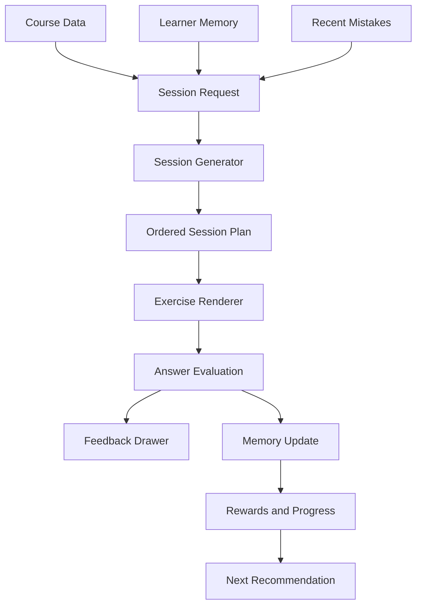

# Duolingo-Inspired Learning Engine Research

This note turns the research pass into a practical architecture for Lingua. It
is not a plan to clone Duolingo feature-for-feature. It is a plan to build the
same kind of learning system in a small, teachable Expo app.

Three focused research lanes were used:

- Official Duolingo sources: product, engineering, curriculum, research, and
  investor materials.
- Academic sources: spaced repetition, half-life regression, knowledge tracing,
  adaptive practice, and gamification research.
- UX and business sources: product-led growth, retention mechanics, monetization
  patterns, and criticism/risk analysis.

## Core Finding

Duolingo is not just a set of exercise screens. The real system is:

```txt
Curriculum model
  -> exercise pool
  -> session generator
  -> adaptive exercise order
  -> immediate feedback
  -> learner-memory update
  -> motivation/reward update
  -> next recommendation
```

For Lingua, the first production-quality version should be a local, simplified
version of that loop using TypeScript data, Zustand, and AsyncStorage.

## Primary Sources

### Official Duolingo Sources

| Source | What it supports | Lingua decision |
| --- | --- | --- |
| https://blog.duolingo.com/the-nuts-and-bolts-of-course-creation-at-duolingo/ | Courses start from goals, CEFR level, vocabulary, grammar, cognitive load, and human curriculum checks. | Build units from can-do goals before writing exercises. |
| https://blog.duolingo.com/how-duolingo-experts-work-with-ai/ | Curriculum design, raw content, exercise creation, and personalization are separate stages. | Keep content authoring separate from session generation. |
| https://blog.duolingo.com/large-language-model-duolingo-lessons/ | AI can draft lessons when constrained by language, CEFR, grammar, vocabulary, and exercise type. | AI generation should produce typed, reviewable lesson data, not direct UI. |
| https://blog.duolingo.com/rewriting-duolingos-engine-in-scala/ | Session Generator chooses which challenges a learner sees and in what order. | Create a central `generateSession()` instead of hardcoding lesson flow. |
| https://blog.duolingo.com/learning-how-to-help-you-learn-introducing-birdbrain/ | Birdbrain predicts if a learner will answer a specific exercise correctly. | Store learner history and estimate difficulty fit locally. |
| https://blog.duolingo.com/new-duolingo-home-screen-design/ | The path mixes new concepts with review and makes practice part of progress. | Learn path should include lesson, review, and checkpoint nodes. |
| https://blog.duolingo.com/spaced-repetition-for-learning/ | Personalized practice uses spacing and accuracy to decide what to review. | Review should rank due concepts, recent mistakes, and weak lessons. |
| https://blog.duolingo.com/duolingo-teaching-method/ | Method pillars: learn by doing, personalize, focus on important content, motivate, delight. | Keep the app exercise-first, short, adaptive, and encouraging. |
| https://blog.duolingo.com/how-duolingo-streak-builds-habit/ | Streaks support habit formation but need flexibility. | Use streaks for consistency, not punishment. |
| https://investors.duolingo.com/news-releases/news-release-details/duolingo-reports-first-quarter-2026-results | Duolingo positions engagement and long-term learner loyalty as core business drivers. | Keep business logic tied to retention and session completion, not only monetization. |

### Academic And Research Sources

| Source | What it supports | Lingua decision |
| --- | --- | --- |
| https://research.duolingo.com/papers/settles.acl16.pdf | Half-life regression predicts recall using practice history and time since practice. It reduced prediction error compared with Leitner in Duolingo data. | Use an HLR-inspired local scheduler, but do not claim it is full HLR. |
| https://aclanthology.org/P16-1174/ | Canonical ACL entry for the HLR paper. | Cite HLR accurately in docs and teaching material. |
| https://research.duolingo.com/ | Duolingo publishes research on spacing, learner modeling, and experimentation. | Keep Lingua data shaped for future research-style improvements. |
| https://spectrum.ieee.org/duolingo | Technical overview of Birdbrain as a learner/item difficulty prediction system. | Treat adaptive difficulty as a future layer above the local scheduler. |
| https://aclanthology.org/W18-0506/ | Second Language Acquisition Modeling task uses learner traces to predict future errors. | Log every answer attempt with concept IDs and correctness. |
| https://doi.org/10.1007/BF01099821 | Classic knowledge tracing. | Track mastery at concept/skill level, not only lesson completion. |
| https://papers.nips.cc/paper/5654-deep-knowledge-tracing | Neural knowledge tracing needs much more data/infrastructure. | Do not add neural modeling in this teaching app. |
| https://doi.org/10.1037/0033-2909.132.3.354 | Distributed practice improves long-term memory. | Space reviews over time instead of only immediate repetition. |
| https://doi.org/10.1145/3491140.3528274 | Gamification can be misused when learners optimize points over learning. | Rewards must reinforce learning behavior, not replace it. |

### UX And Business Sources

| Source | What it supports | Lingua decision |
| --- | --- | --- |
| https://techcrunch.com/2021/05/03/duolingo-ec1-product/ | Product-led learning loop and retention mechanics. | Keep the core loop simple: lesson, feedback, reward, next best action. |
| https://techcrunch.com/2021/05/03/duolingo-ec1-monetization/ | Freemium, ads, subscriptions, and convenience upgrades. | Do not lock core learning behind monetization in this project version. |
| https://growth.design/case-studies/duolingo-user-retention | UX teardown of habit and onboarding mechanics. | Use as design inspiration, not primary evidence. |
| https://trophy.so/blog/duolingo-gamification-case-study | Breakdown of streaks, XP, leagues, quests, and achievements. | Model motivation as an outcome layer shared by all session types. |
| https://arxiv.org/abs/2203.16175 | Criticism that gamification can distort learning behavior. | Keep learning quality above XP, streaks, and cosmetic rewards. |

## Evidence Strength

Use these confidence levels when teaching or explaining the app:

- High confidence: official product/research pages, peer-reviewed papers,
  investor filings.
- Medium confidence: official blog posts about A/B tests or product direction,
  because they are company-reported and may omit tradeoffs.
- Lower confidence: third-party UX teardowns and business essays. They are
  useful for product thinking but should not be treated as proof.

## What To Build

Lingua should move toward one universal learning engine.



The same system should power:

- normal lesson sessions
- daily challenge
- spaced review
- mistake practice
- checkpoint quizzes
- vocabulary practice
- listening practice
- future AI teacher sessions
- future chat tutor sessions
- future speaking/video sessions

## Why This Architecture

### 1. Curriculum Comes First

Duolingo course creation starts with communicative goals and curriculum design.
Lingua should not generate random exercises first. Every unit needs:

- language ID
- CEFR level
- can-do goal
- target vocabulary
- grammar focus
- known prerequisites
- checkpoint goal

### 2. Sessions Are Generated, Not Just Displayed

A lesson should not be only `lesson.exercises.map(...)`. It should become a
session request:

```ts
type SessionIntent =
  | "lesson"
  | "review"
  | "mistakes"
  | "checkpoint"
  | "daily-challenge"
  | "ai-teacher"
  | "chat-tutor";
```

Then `generateSession()` chooses the right exercises from:

- the current lesson
- due review concepts
- recent mistakes
- checkpoint pool
- allowed exercise types
- learner difficulty fit

### 3. Learner Memory Is The Product Brain

Phase 4 added lesson-level memory. The next version should move from lesson
memory toward concept memory.

```ts
type ConceptMemory = {
  conceptId: string;
  seenCount: number;
  correctCount: number;
  incorrectCount: number;
  lastPracticedAt: number;
  halfLifeDays: number;
  streakCorrect: number;
};
```

Predicted recall can stay simple:

```txt
recall = 2 ^ (-daysSincePractice / halfLifeDays)
```

Good review targets are usually concepts with predicted recall around
`0.65` to `0.85`: not too easy, not too discouraging.

### 4. Exercise Metadata Matters More Than UI Type

Every exercise should carry metadata so the engine can reason about it.

```ts
type ExerciseMetadata = {
  conceptIds: string[];
  vocabularyIds?: string[];
  skillId?: string;
  unitId: string;
  languageId: string;
  cefrLevel?: "A1" | "A2" | "B1" | "B2" | "C1" | "C2";
  difficulty: "intro" | "practice" | "challenge";
  estimatedSeconds?: number;
};
```

The UI can still be simple, but the data should be engine-ready.

### 5. Feedback Must Be Specific

Feedback should answer:

- Was I correct?
- What was the correct answer?
- Why, if needed?
- What should I do next?

This supports the existing `FeedbackDrawer`, and it also prepares the app for
AI-generated explanations later.

### 6. Motivation Is An Outcome Layer

XP, streaks, hearts, combo, achievements, and review badges should be updated
from session results, not scattered across every screen.

```ts
type SessionResult = {
  sessionId: string;
  intent: SessionIntent;
  score: number;
  correctCount: number;
  totalCount: number;
  mistakes: MistakeRecord[];
  practicedConceptIds: string[];
  xpEarned: number;
  streakEligible: boolean;
};
```

## Universal Exercise Design

The Japanese fill-in problem revealed a general system need: beginners often
need guided answer construction instead of keyboard typing.

So the app should support a universal answer-builder exercise, not a
Japanese-only fix.

```ts
type WordBankOption = {
  value: string;
  label: string;
  pronunciation?: string;
  translation?: string;
};
```

Use it for:

- Japanese phrase chunks with romaji
- Arabic words with transliteration
- French or Spanish sentence ordering
- English pronunciation practice
- grammar slots like pronoun + verb + object

Interaction rule:

```txt
Tap is primary.
Drag is enhancement.
Typing comes later.
```

This keeps the project reliable on mobile while still feeling interactive.

## Recommended Session Recipes

### Normal Lesson

```txt
70 percent current lesson
20 percent older review
10 percent recent mistakes
```

### Review Session

```txt
50 percent due concepts
30 percent recent mistakes
20 percent mixed earlier content
```

### Checkpoint

```txt
100 percent unit concepts
harder exercises only
no hearts
score threshold decides pass/fail
```

### Daily Challenge

```txt
1 urgent lesson or concept group
short session
bonus XP only after meaningful completion
```

## Data To Preserve From Every Attempt

Even if the app stays local, store the data that a real learning engine needs:

```ts
type ExerciseAttempt = {
  exerciseId: string;
  sessionId: string;
  intent: SessionIntent;
  languageId: string;
  unitId?: string;
  lessonId?: string;
  conceptIds: string[];
  exerciseType: string;
  difficulty?: string;
  correct: boolean;
  selectedAnswer?: string;
  correctAnswer: string;
  responseTimeMs?: number;
  hintsUsed?: number;
  createdAt: number;
};
```

This gives us the future option to improve:

- review scheduling
- difficulty estimates
- mistake practice
- dashboards
- AI tutor personalization
- course quality checks

## Business Logic

For this teaching app, business logic should mean product logic first:

- user returns daily
- user completes sessions
- user corrects mistakes
- user reviews due content
- user passes checkpoints
- user feels progress

Do not build monetization yet. If monetization is added later, keep core lessons
free and put paid value around convenience or richer practice:

- deeper AI explanations
- more conversation practice
- saved reports
- cosmetics
- ad-free experience

## Risks And Guardrails

| Risk | Guardrail |
| --- | --- |
| Building too much ML too early | Start with clear local rules and typed data. |
| Gamification replacing learning | Reward review, accuracy, mistake repair, and completion. |
| Hearts discouraging beginners | Use hearts gently and offer recovery. |
| AI content reducing trust | Keep AI output typed, reviewable, and constrained by curriculum metadata. |
| Language-specific hacks | Build exercise primitives that work across languages. |
| Huge screen-level files | Extract reusable session engine code when duplication appears. |

## Implementation Order

Do one step at a time:

1. Add universal exercise metadata.
   - Add `conceptIds`, `difficulty`, `skillId`, and `cefrLevel` to exercises.
   - Do not rewrite all lesson content at once.

2. Extract session generation.
   - Create `src/utils/sessionGenerator.ts`.
   - Input: lesson/review/checkpoint request plus store memory.
   - Output: ordered exercises.

3. Add attempt logging.
   - Persist attempts or recent attempt summaries in Zustand.
   - Update lesson memory and future concept memory from the same result.

4. Generalize answer-builder exercises.
   - Use word-bank data for every language where guided construction helps.
   - Keep tap as primary and drag as secondary.

5. Move motivation updates behind session results.
   - XP, streak, hearts, combo, checkpoints, and review should all respond to
     `SessionResult`.

6. Add concept-level review.
   - Move beyond only lesson-level forgetting.
   - Keep HLR-inspired calculations simple and teachable.

7. Add AI teacher/chat sessions into the same loop.
   - AI sessions should produce `SessionResult`, mistakes, practiced concepts,
     and feedback just like normal lessons.

## What Not To Claim

Do not say Lingua has Duolingo Birdbrain. Lingua can have a local
Birdbrain-inspired scheduler.

Do not say XP or level equals real language proficiency. It is app progress.

Do not say spaced repetition is perfect. It is evidence-backed, but the interval
quality depends on learner, content, and goal.

Do not say gamification always improves learning. It can improve persistence,
but it must not reward shallow behavior.

## Next Best Step

The next implementation step should be:

```txt
Build the universal session engine foundation:
1. Add exercise metadata fields.
2. Create session generator utility.
3. Route lesson, review, and checkpoint sessions through it.
4. Keep existing UI behavior unchanged while the engine becomes cleaner.
```

This is broader than the Japanese word-bank fix. The word-bank/drag interaction
should become one exercise primitive inside the universal engine.
